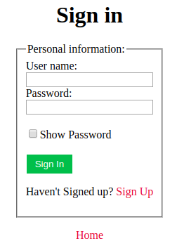

# SubsetSumProblem
Subset Sum Problem algorithm based SignIn/ SignUp implementation in HTML, Javascript

Using:
1. Clone the repo in local machine or download repo as Zip on local machine & extract it

  git clone https://github.com/himanshusandha/SubsetSumProblem.git
 
2. Open Subset Sum Problem.html on any browser. 

  

  <pre><b>Theory:</b>
    There are security problems other than public-key codes for which subset-sum problems are useful.

    <b>Computer passwords</b>
    A computer needs to verify a user's identity before allowing him or her access to an account. The simplest system
    would have the machine keep a copy of the password in an internal file, and compare it with what the user types. A
    drawback is that anyone who sees the internal file could later impersonate the user.

    I believe this alternative is actually implemented on some systems: the computer generates a large number (say 500)
    of ai. They are stored in the internal file. A password is a subset of {1,...,500}. (in practice, there is
    a program to convert a normal sequence-of-symbols password to such a subset.) Instead of having the password for the
    user, the computer keeps the total associated with the appropriate subset. When the user types in the subset, the
    computer tests whether the total is correct. It does not keep a record of the subset. Thus impersonation is possible
    only if somebody can reconstruct the subset knowing the ai and the total.

    <b>Message verification</b>
    A sender (S) wants to send messages to a receiver (R). Keeping the message secret is not important. However, R wants
    to be sure that the message he is receiving is not from an imposter and has not been tampered with. S and R
    agree on a set of ai (say 500) and a set of totals Tj (say 200). These numbers may be publicly known, but only
    S knows which subsets of the ai correspond to which Tj. The message sent by S is a subset of size 100 of
    {1,..,200}. He does this by sending 100 subsets of the ai corresponding to the message he wants to send.
  </pre>
